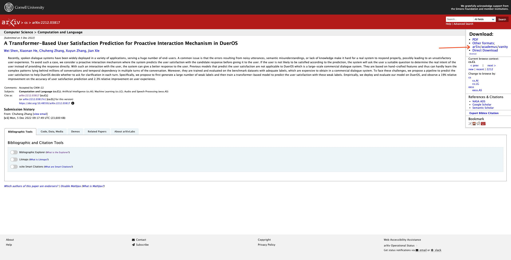

# Render arXiv paper as HTML links

Browser Extension.  

Append [ar5iv](https://ar5iv.org/), [academus](http://www.academ.us/) and [arxiv vanity](http://arxiv-vanity.com) links to [arXiv](https://arxiv.org/).  

